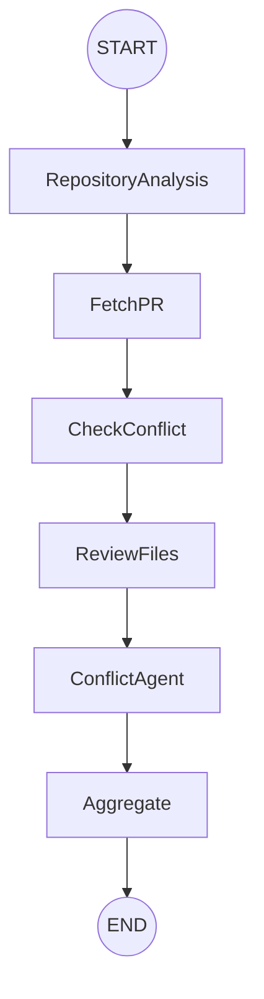

# AI-Powered PR Review & Merge Conflict Resolution Agent

An AI-powered **Multi-Agent Pull Request Review System** built with **LangGraph**, **FastAPI**, **Groq LLMs**, and **GitHub APIs**.

The system automatically analyzes a .NET repository, understands its architecture, reviews Pull Request changes, detects merge conflicts, generates AI-powered recommendations, and posts structured review comments directly on GitHub.

Designed as a production-style AI workflow that demonstrates Agentic AI, LLM orchestration, repository understanding, and developer automation.

---

# Features

✅ Multi-Agent Architecture using LangGraph

✅ Repository Architecture Analysis Agent

✅ AI-based Pull Request Code Review

✅ Merge Conflict Resolution Agent

✅ Automatic GitHub Webhook Integration

✅ Automatic GitHub PR Review Comments

✅ Repository Context-Aware Reviews

✅ Repository Analysis Caching

✅ .NET Repository Understanding

✅ Structured Executive Review Reports

---

# Project Architecture


---

# End-to-End Workflow

```text
Developer Creates Pull Request
            │
            ▼
     GitHub Webhook
            │
            ▼
      FastAPI Endpoint
            │
            ▼
      LangGraph Workflow
            │
            ▼
─────────────────────────────────────
Repository Analysis Agent
─────────────────────────────────────

Clone Repository

↓

Scan Solution Structure

↓

Read README

↓

Analyze .NET Projects

↓

Generate Repository Summary

↓

Store Cache

─────────────────────────────────────
Pull Request Review
─────────────────────────────────────

Fetch Changed Files

↓

Check Merge Conflict

↓

Review Every Changed File

↓

Aggregate Reviews

↓

Generate Executive Summary

↓

Post Review to GitHub PR

↓

If Merge Conflict Exists

↓

Run Merge Conflict Agent

↓

Suggest Resolution

↓

Post Conflict Comment
```

---

# LangGraph Workflow



---

# Multi-Agent Design

## Repository Analysis Agent

Responsible for understanding the complete repository before reviewing code.

Responsibilities

- Clone repository
- Scan folder structure
- Read README
- Analyze .NET solution
- Detect projects
- Generate repository summary
- Cache repository analysis

---

## PR Review Agent

Reviews every modified file individually.

Focus Areas

- Bugs
- SOLID Principles
- Dependency Injection
- Entity Framework
- Async/Await
- Security
- Performance
- Regression Risks
- .NET Best Practices

---

## Merge Conflict Agent

Runs only when GitHub reports merge conflicts.

Responsibilities

- Detect conflicting PR
- Compare Base vs Feature branch
- Explain why conflict occurred
- Generate merge suggestion
- Recommend safest resolution

---

# Tech Stack

## Backend

- Python
- FastAPI

## Agent Framework

- LangGraph

## LLM

- Groq
- Llama 3.3 70B Versatile

## Git Integration

- GitHub API
- GitPython

## Repository Analysis

- Custom .NET Scanner
- README Parser
- Solution Reader
- Project Reader

---

# Project Structure

```text
AI-PR-Review-Agent
│
├── agents/
│   ├── RepositoryAgent
│   └── ConflictAgent
│
├── graphs/
│   └── LangGraph Workflow
│
├── services/
│   ├── PR Reviewer
│   ├── Architecture Analyzer
│   ├── Review Aggregator
│   ├── Conflict Resolver
│   ├── Cache Service
│   └── GitHub Comment Service
│
├── tools/
│   ├── GitHub Tool
│   ├── Git Tool
│   ├── Repo Scanner
│   ├── Solution Reader
│   ├── Program Reader
│   ├── DotNet Explorer
│   └── README Reader
│
├── api/
│   └── GitHub Webhook
│
└── main.py
```

---

# Example Flow

```
Developer Opens PR

↓

GitHub Webhook Triggered

↓

Repository Analysis

↓

Repository Summary Generated

↓

Changed Files Retrieved

↓

AI Reviews Every File

↓

Executive Summary Generated

↓

GitHub Review Posted

↓

If Merge Conflict Exists

↓

Merge Conflict Agent Runs

↓

Conflict Resolution Posted
```

---

# Example Output

### Code Review

- Executive Summary
- High Severity Issues
- Medium Severity Issues
- Low Severity Issues
- Final Recommendation

### Merge Conflict

- Why conflict occurred
- Files involved
- Suggested merged code
- Risk Assessment

---

# Running the Project

## Install

```bash
pip install -r requirements.txt
```

## Configure

Create a `.env`

```text
GROQ_API_KEY=YOUR_GROQ_KEY

GITHUB_TOKEN=YOUR_GITHUB_TOKEN
```

## Start FastAPI

```bash
uvicorn app:app --reload
```

## Configure GitHub Webhook

```
Pull Request Opened

↓

Webhook Triggered

↓

AI Review Starts Automatically

↓

Comments Posted Back to GitHub
```

---

# Future Improvements

- Azure DevOps Integration
- Parallel Agent Execution
- Inline GitHub Review Comments
- Security Agent
- Test Coverage Agent
- Code Quality Agent
- Vector Database Repository Memory
- RAG-based Repository Search
- GitHub Actions Deployment

---

# Resume Highlights

- Built a production-style Multi-Agent AI Pull Request Review System using LangGraph.

- Implemented automated repository architecture analysis for .NET projects.

- Designed AI agents for contextual code review and merge conflict resolution.

- Integrated GitHub Webhooks for real-time PR analysis.

- Automated GitHub PR review comments using GitHub APIs.

- Reduced repository analysis latency using intelligent caching.

---

# Screenshots

Architecture


Workflow


GitHub PR Review


Merge Conflict Review


