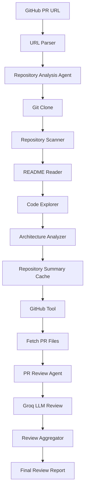

Built a multi-agent AI-powered Pull Request Review System using LangGraph, Groq LLMs, and GitHub APIs. The system performs repository architecture analysis, contextual code reviews, and automated review aggregation with caching support.

# AI PR Review Agent

An AI-powered Pull Request Review Agent built using LangGraph, Groq LLMs, and GitHub APIs.

The system automatically analyzes a GitHub repository, understands its architecture, fetches Pull Request changes, reviews modified files using an LLM, and generates a consolidated review report.

---

## Features

* Repository Architecture Analysis
* GitHub Pull Request Integration
* File-Level Code Review
* Context-Aware Reviews using Repository Understanding
* LangGraph Workflow Orchestration
* Review Aggregation
* Repository Analysis Caching
* URL Parsing and Repository Detection

---

## Architecture

1. Analyze repository structure
2. Generate repository summary
3. Fetch Pull Request files
4. Review each changed file using LLM
5. Aggregate reviews into a final report

---

## Tech Stack

### AI

* Groq
* Llama 3.3 70B

### Agent Framework

* LangGraph

### Backend

* Python

### Integrations

* GitHub API

---

## Workflow

Repository URL
↓
Repository Analysis Agent
↓
Repository Summary
↓
GitHub PR Files
↓
PR Review Agent
↓
Review Aggregator
↓
Final Review Report

---

## Example

Input:

Repository:
https://github.com/langchain-ai/langgraph

Pull Request:
8093

Output:

* Executive Summary
* Risk Assessment
* Architecture Impact
* Performance Concerns
* Regression Risks
* Final Recommendation

---

## Running

Install dependencies:

pip install -r requirements.txt

Create .env:

GROQ_API_KEY=YOUR_KEY
GITHUB_TOKEN=YOUR_TOKEN

Run:

python main.py

---

## Future Improvements

* Parallel File Reviews
* GitHub PR Comments
* Automatic PR Approval Suggestions
* Security Review Agent
* Test Coverage Agent
* CI/CD Integration

---

## Author

Aanya.

